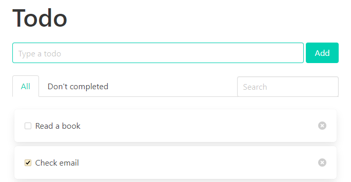

# react-redux-todo

This is a simple todo app. Here I improved my knowledge of React, Redux and Bulma CSS framework.



# For developers

Installs the project

```
git clone https://github.com/yurimikushov/react-redux-todo.git
cd react-redux-todo
npm i
```

Checks a follow CSS writing conventions

```
npm run stylelint
```

Checks a follow JS writing conventions

```
npm run eslint
```

Runs the app in `development` mode on `localhost:3000`

```
npm start
```

Builds the app for `production` to the `build` folder

```
npm build
```

# License

The project is available under the [MIT License](LICENSE).
